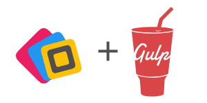

Gulp plugin for SVG files compression using Nano. For more information, visit [Nano](https://vecta.io/nano)

## Installation

`npm install gulp-nano`

## Authentication

Obtain API Key in [Nano](https://vecta.io/nano)

## Usage

```javascript
var gulp = require('gulp'),
    gulp_nano = require('gulp-nano');

gulp.task('Compress SVG', function () {
    return gulp.src('./*.svg')
        .pipe(gulp_nano({ key: <YOUR API KEY>, mode: <COMPRESSION MODE> }))
        .pipe(gulp.dest('./compressed/'));
});
```

### Options

`key <string>` 

- API key obtained from [Nano](https://vecta.io/nano)

`mode <number>` 

- 0 = image mode [default] (with font embedding)
- 1 = object mode (without font embedding)

`precision <number>`

- Precision of numerical values in SVG.
- 3 [default]

## License

This software is licensed under the MIT License. [View the license](LICENSE).
